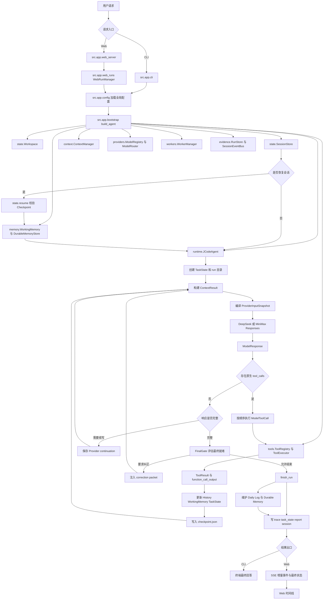
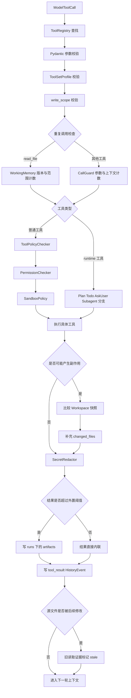
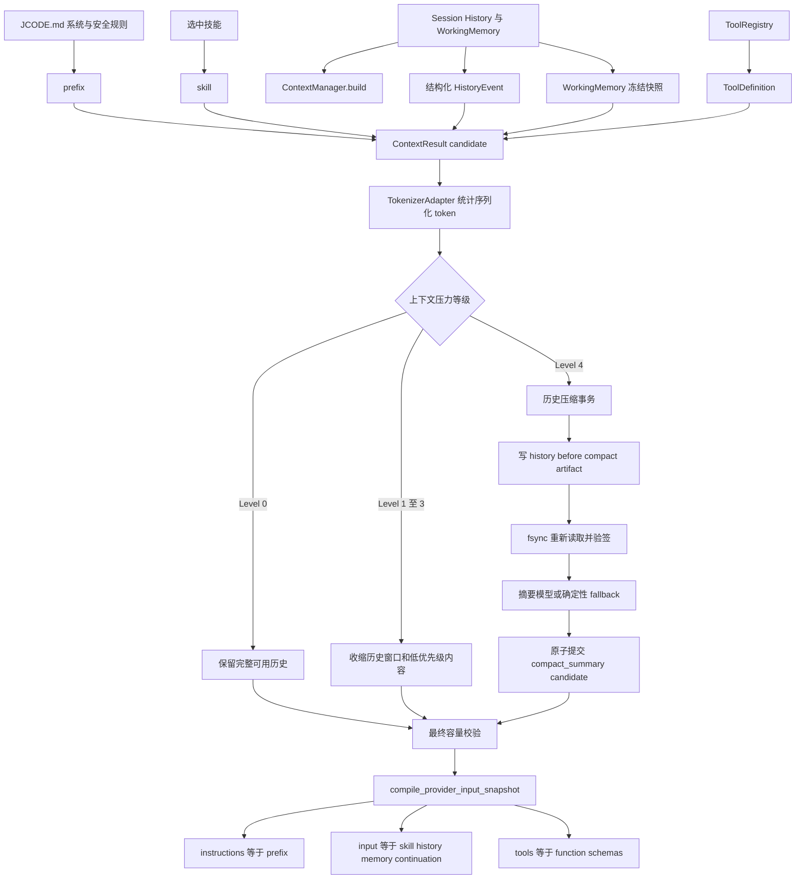
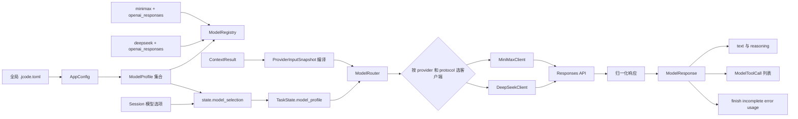
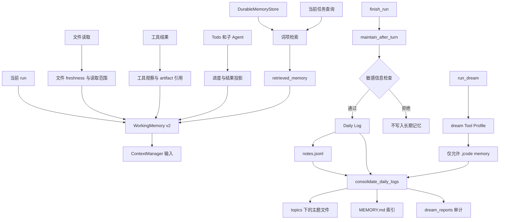
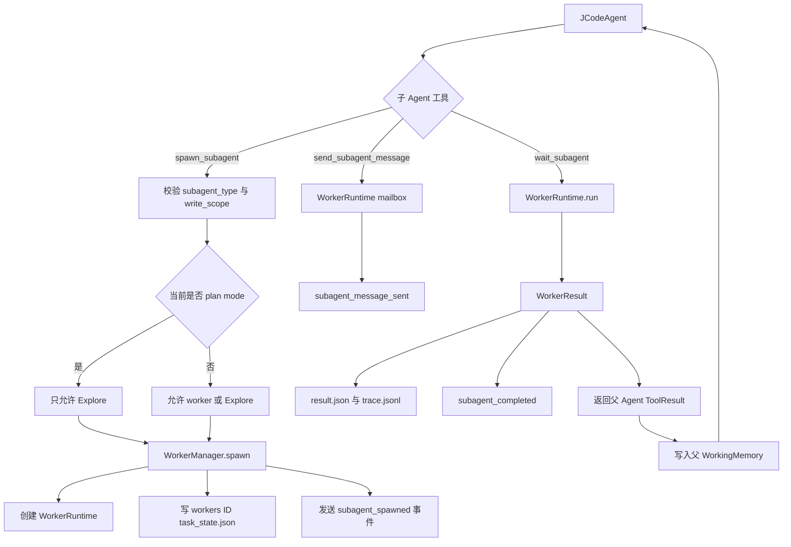
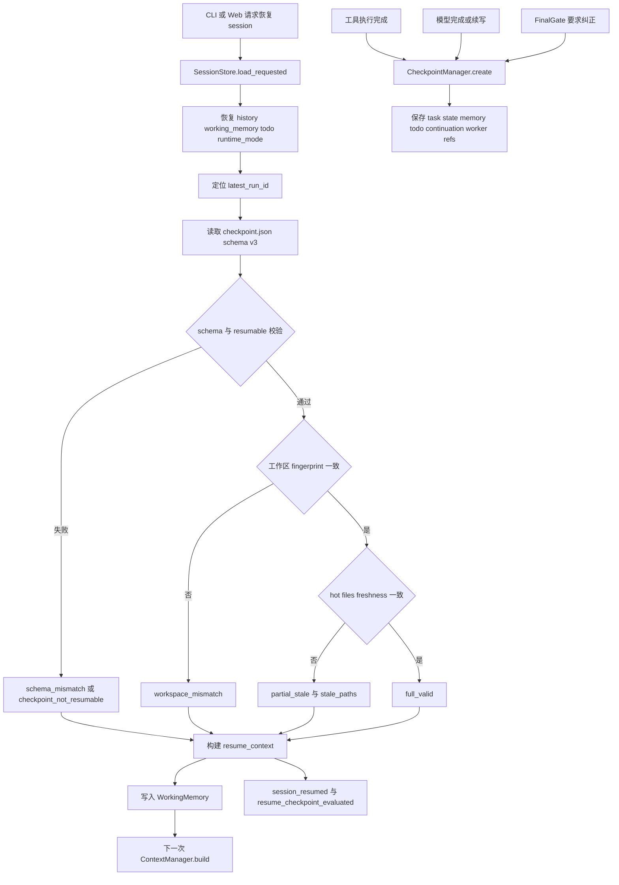
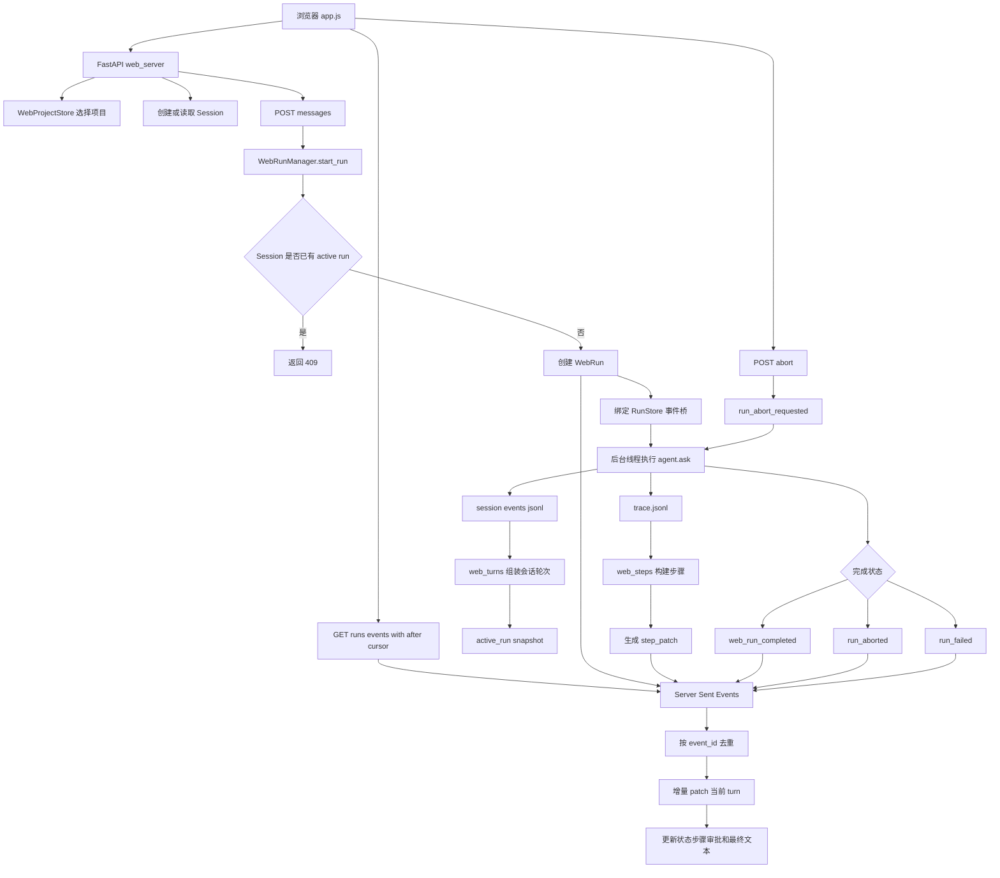

# JCode 项目完整链路

本文以当前代码为准，用 Mermaid 展示 JCode 从 CLI 或 Web 接收请求，到上下文构建、Provider 调用、工具循环、状态持久化、记忆维护和最终展示的完整链路。

## 1. 端到端总图



主循环由 `src/runtime/agent.py:JCodeAgent._ask_loop()` 驱动。一次模型响应可以包含多个原生工具调用；工具结果写回 Provider continuation 后进入下一子轮。没有工具调用时，运行时根据完成状态、输出续写和 FinalGate 决定继续或结束。

## 2. 工具治理分支



核心源码：

- `src/tools/executor.py`：统一工具治理入口。
- `src/tools/registry.py`：工具注册和 schema 输出。
- `src/policy/call_guard.py`、`permissions.py`、`sandbox.py`、`tool_rules.py`：调用、权限和副作用策略。
- `src/tools/workspace.py`、`shell.py`：工作区文件与 shell 实现。
- `src/evidence/tool_artifacts.py`：大结果外置和观察摘要。

详见 [工具治理完整链路](工具治理完整链路.md)。

## 3. 上下文治理分支



发送前必须满足：

```text
serialized_input_tokens + actual_max_new_tokens + safety_margin_tokens
<= min(375000, profile.context_window_tokens)
```

超限会抛出结构化运行时错误，不会静默截断。详见 [上下文治理完整链路](上下文治理完整链路.md)。

## 4. Provider 分支



注册表按 `(provider, api_protocol)` 选择工厂，并按 profile 缓存客户端。模型只能在 run 之间切换；run 开始后只使用 `TaskState.model_profile` 快照。详见 [Provider 架构与模型切换链路](Provider架构与模型切换链路.md)。

## 5. 记忆分支



WorkingMemory 是当前运行控制面，Daily Log 是过程层，Durable Memory 是稳定结论层。详见 [记忆系统完整链路](记忆系统完整链路.md)。

## 6. 子 Agent 分支



当前子任务类型只有 `worker` 和 `Explore`。写能力同时受 Tool Profile 和显式 `write_scope` 约束；plan mode 只允许创建 `Explore`。子 Agent 结果不会直接成为最终回答，而是作为工具结果和 WorkingMemory 信息返回主循环。

## 7. 恢复与 Checkpoint 分支



Checkpoint 保存恢复所需运行快照，但恢复结果只进入 WorkingMemory，不重写既有 HistoryEvent。`workspace_mismatch` 表示整体工作区指纹变化；`partial_stale` 表示最近读取文件的 freshness 发生变化。

## 8. Web 事件分支



活动 run 从内存事件队列增量推送；历史 run 从 `trace.jsonl` 重放。客户端用 `after` cursor 和 `event_id` 去重，`step_patch` 只更新变化的步骤，避免整页或整段会话反复重绘。

## 9. 持久化布局

```text
.jcode/
  runs/<run_id>/
    trace.jsonl
    task_state.json
    checkpoint.json
    report.json
    artifacts/
  sessions/
    <session_id>.json
    <session_id>.events.jsonl
  memory/
    MEMORY.md
    notes.jsonl
    logs/YYYY/MM/YYYY-MM-DD.md
    topics/*.md
    dream_reports/*.json
  workers/<worker_id>/
    task_state.json
    trace.jsonl
    result.json
```

## 10. 源码阅读顺序

1. `src/app/cli.py`、`src/app/web.py`：启动入口。
2. `src/app/config.py`、`src/app/bootstrap.py`：配置与依赖装配。
3. `src/runtime/agent.py`：模型、工具、续写、终态主循环。
4. `src/context/manager.py`、`src/providers/request.py`：上下文与请求快照。
5. `src/providers/registry.py`、`router.py`、`deepseek.py`、`minimax.py`：Provider 链路。
6. `src/tools/executor.py`、`src/policy/`：工具与安全治理。
7. `src/state/checkpoint.py`、`resume.py`、`session.py`：持久化与恢复。
8. `src/memory/`、`src/workers/`、`src/evidence/`：记忆、子 Agent 和审计。
9. `src/app/web_runs.py`、`web_events.py`、`web_steps.py`、`web_turns.py`：Web 增量展示。
